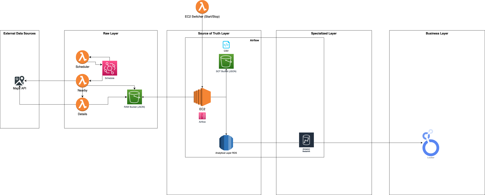

# Data Cloud Project - Google Maps
Repository that contains only the general documentation about the Data Cloud Project - Google Maps, which is a set of some repositories.

  
  
  
  
  
  

## Project contextualization

### Motivation
My project draws its inspiration from my past role as a Growth Business Intelligence professional at a SaaS startup specializing in restaurant management solutions. In this capacity, my primary responsibility was to curate data for prospecting new customers. 

To accomplish this, I initially turned to Google Maps as a valuable data source. However, my vision for the project extends beyond this initial data source. I aim to aggregate and integrate data from various platforms, including web scraping delivery platforms or websites like TripAdvisor, in order to create a comprehensive and insightful dataset. This holistic approach ensures that my project remains adaptable and capable of delivering multifaceted solutions by harnessing data from diverse sources in the restaurant industry.

### Goals
This idea represents an exciting opportunity to not only collect valuable data for prospecting but also to hone and expand my data engineering skills. It serves as a dynamic platform to apply and develop a data pipeline that traverses various tools, programming languages, and challenges. 

Building this pipeline will not only involve data collection but also data cleaning, transformation, and storage, presenting multifaceted technical challenges to overcome. By embracing this project, I can further solidify my expertise in data engineering, refine my ability to work with diverse data sources, and enhance my proficiency in the programming languages and technologies that power effective data pipelines.

## Basic/Initial Architecture

## Data Source (Google Maps API)

The Google Maps API for Places is a powerful tool that provides developers with access to a vast database of location-related information. It offers two essential functionalities: "Nearby Search" and "Place Details Search."

### Google Maps API - Nearby Search
The "Nearby Search" feature allows developers to retrieve a list of places within a specified geographic radius of a given location. This functionality is incredibly versatile and can be used to find various types of places, such as restaurants, hotels, or landmarks. By specifying parameters like latitude, longitude, radius, and optional keyword filters, developers can tailor their queries to obtain specific results. The response includes crucial details about each place, such as its name, address, user ratings, opening hours, and contact information. This feature is invaluable for applications that require location-based data, enabling developers to create services ranging from restaurant finders to local business directories.

### Google Maps API - Details Search
The "Place Details Search" complements the "Nearby Search" by providing comprehensive information about a specific place. To use this feature, developers provide a unique identifier known as a "Place ID" obtained from a previous search or user selection. The API then returns a wealth of data about the chosen place, including high-resolution photos, user reviews, website URLs, and formatted addresses. This feature is ideal for creating enriched, user-friendly applications that offer in-depth insights into individual locations. It's commonly used for building apps with features like detailed business profiles, reviews, and visual galleries, enhancing the user experience.

## Raw Layer
Gets the data from the API considering a certain logic explained with more details in each repository.
Basically, the Schedule Lambda Function organize (with the CloudWatch Scheduler Service) the others Nearby Lambda Functions to request in the Nearby Search API during the month. Then the the Detail Lambda Function is triggered.

### Scheduler
There's a repo for the Scheduler Function <a href="https://github.com/juliolimoli/data-cloud-project-scheduler" target="_blank">here</a>.

### Nearby
There's a repo for the Nearby Function <a href="https://github.com/juliolimoli/data-cloud-project-gmaps-place-nearby" target="_blank">here</a>.

### Details
There's a repo for the Details Function <a href="https://github.com/juliolimoli/data-cloud-project-gmaps-place-details" target="_blank">here</a>.

## Source of Truth Layer
The source of truth layer in my project is anchored by an EC2 machine running Apache Airflow. This robust orchestration platform is the cornerstone of data normalization and management. It meticulously oversees the process of cleaning, transforming, and structuring the collected data before seamlessly loading it into an Analytical Database. Once the data is organized and ready for deeper analysis, Airflow plays another pivotal role by efficiently uploading it to a Redshift cluster. This layered approach ensures data accuracy, consistency, and accessibility, making it the trusted foundation for driving valuable insights and informed decision-making in the project.

It will get the json files, convert it into CSV, upload to DB and upload to redshift.

To optimize cost management and resource utilization, I've developed a Lambda function as a part of my project. This Lambda function dynamically controls the state of the EC2 instance where Apache Airflow is hosted. It intelligently switches the instance on only when there's a scheduled Airflow DAG (Directed Acyclic Graph) execution pending. By doing so, I minimize unnecessary downtime and associated costs, ensuring that the EC2 instance is active precisely when required for DAG runs. This cost-effective and efficient approach guarantees that computing resources are utilized judiciously, aligning with the project's goals of maximizing value while minimizing expenses.

### Lambda Function - EC2 Switcher
There's a repo for the EC2 Switcher Function <a href="https://github.com/juliolimoli/lambda_ec2_switcher" target="_blank">here</a>. This one was built in Node.JS to practice another language.